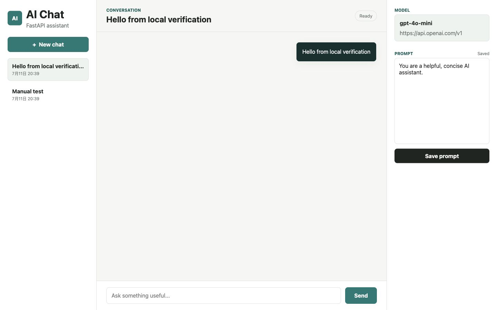

# AI Research Assistant Workbench

A practical AI application for studying model behavior, retrieval-augmented generation, and long-term knowledge grounding. The project is designed as a graduate-application portfolio artifact: it is usable as a local assistant, but also exposes measurable AI-system behavior instead of hiding the model behind a simple chat box.



## Problem Background

General chat assistants are useful, but they are difficult to evaluate and easy to over-trust. A stronger AI application should answer three questions:

- Can the assistant ground answers in user-provided knowledge instead of only relying on the base model?
- Can different OpenAI-compatible models be compared with repeatable metrics?
- Can the system make tradeoffs visible, such as latency versus answer quality?

This project turns a lightweight chat app into an experiment workbench for those questions. It supports normal chat, RAG-based chat with cited sources, persistent conversation history, and model comparison runs.

## System Architecture

```text
Browser UI
  ├─ Chat + streaming SSE
  ├─ Knowledge upload + RAG toggle
  └─ Model evaluation panel

FastAPI backend
  ├─ app/main.py          API routes and static app
  ├─ app/chat.py          conversation orchestration
  ├─ app/llm.py           OpenAI-compatible streaming client
  ├─ app/rag.py           chunking, local embeddings, retrieval, citations
  ├─ app/evaluation.py    model comparison workflow
  ├─ app/repositories.py  SQLite data access
  └─ app/database.py      schema and initialization

SQLite
  ├─ sessions / messages / settings
  ├─ documents / document_chunks
  └─ evaluation_runs / evaluation_results
```

## Key Technical Choices

- **FastAPI + SSE**: keeps the backend small while supporting real-time streamed model output and event types such as `session`, `sources`, `delta`, `done`, and `error`.
- **OpenAI-compatible client**: model calls are isolated in `app/llm.py`, so the app can use OpenAI or another provider that exposes a compatible Chat Completions API.
- **SQLite persistence**: stores conversations, prompt settings, knowledge base chunks, and evaluation results without requiring external infrastructure.
- **Local hashing embeddings**: `app/rag.py` uses deterministic local vectors for retrieval so document upload, search, and tests work without an API key. This can later be replaced by OpenAI embeddings, FAISS, Chroma, or another vector store.
- **Experiment-first evaluation**: `app/evaluation.py` records latency, first-token time, estimated or provider-reported tokens, heuristic output quality, and multi-turn consistency.

## Features

- Browser chat interface with persisted sessions.
- Streaming assistant responses over Server-Sent Events.
- Editable system prompt.
- RAG mode with document upload, chunk storage, retrieval, and cited source excerpts.
- Model evaluation runs across one or more OpenAI-compatible model names.
- Health endpoint that reports whether an API key is configured.
- Automated regression tests for chat, RAG, retrieval, and evaluation flows.

## Local Setup

1. Create and activate a virtual environment:

```bash
python -m venv .venv
source .venv/bin/activate
```

2. Install dependencies:

```bash
pip install -r requirements.txt
```

3. Create a local environment file:

```bash
cp .env.example .env
```

4. Edit `.env` when you have a real provider key:

```env
OPENAI_API_KEY=
OPENAI_BASE_URL=https://api.openai.com/v1
OPENAI_MODEL=gpt-4o-mini
TEMPERATURE=0.7
MAX_HISTORY_MESSAGES=20
```

Leave `OPENAI_API_KEY` blank for local RAG and UI testing. The app will run and return clear model-configuration errors instead of sending requests with a placeholder key.

5. Start the app:

```bash
uvicorn app.main:app --reload
```

6. Open:

```text
http://127.0.0.1:8000
```

## API Overview

| Method | Path | Purpose |
| --- | --- | --- |
| `GET` | `/` | Browser app |
| `GET` | `/api/health` | Runtime model/provider readiness |
| `GET` | `/api/sessions` | List chat sessions |
| `POST` | `/api/sessions` | Create a chat session |
| `GET` | `/api/sessions/{session_id}/messages` | Read message history |
| `POST` | `/api/chat/stream` | Stream normal or RAG chat |
| `GET` | `/api/prompt` | Read system prompt |
| `PUT` | `/api/prompt` | Update system prompt |
| `GET` | `/api/documents` | List knowledge documents |
| `POST` | `/api/documents` | Add a document to the knowledge base |
| `POST` | `/api/retrieval/preview` | Inspect retrieved sources for a query |
| `GET` | `/api/evaluations` | List recent model evaluation runs |
| `POST` | `/api/evaluations` | Run a model comparison |

## RAG Workflow

1. Upload or paste a document in the Knowledge panel.
2. The backend chunks the text, embeds each chunk locally, and stores chunks in SQLite.
3. Turn on `RAG answers`.
4. Ask a question.
5. The stream emits retrieved `sources` before answer tokens, and the UI shows source excerpts alongside the answer.

Example stream shape:

```text
event: session
data: {"session_id": 1}

event: sources
data: {"sources": [{"source_id": "S1", "document_title": "Project notes", ...}]}

event: delta
data: {"content": "The uploaded notes suggest... [S1]"}
```

## Model Evaluation Design

Each evaluation run compares one or more model names using the same prompt. The system records:

- **Response latency**: total wall-clock time for the streamed response.
- **First-token time**: time until the first streamed token arrives.
- **Token consumption**: provider-reported usage when available, otherwise a deterministic estimate.
- **Output quality**: a transparent heuristic based on prompt coverage, answer structure, and useful length.
- **Multi-turn consistency**: whether the model remembers a user constraint across turns.

The quality score is intentionally simple and inspectable. It is not a replacement for human evaluation; it is a baseline metric that makes repeated experiments easier.

## Example Experiment Table

Run your own comparison from the Evaluation panel after setting `OPENAI_API_KEY`. Results are persisted in SQLite and can be retrieved from `/api/evaluations`.

| Model | Latency | First Token | Tokens | Quality | Consistency |
| --- | ---: | ---: | ---: | ---: | ---: |
| configured model | measured at runtime | measured at runtime | reported/estimated | 0-100% | 0-100% |

Without an API key, evaluation runs still save provider-configuration errors so setup failures are visible and testable.

## Verification

Run automated regression tests:

```bash
python -m unittest discover -s tests -q
```

Run a syntax check:

```bash
python -m compileall app tests
```

Check dependency compatibility:

```bash
python -m pip check
```

Current verified baseline:

```text
Ran 9 tests ... OK
No broken requirements found.
```

## Project Value

This is not only a chat demo. It is a small but complete AI-system workbench that shows:

- how model output changes when grounded in retrieved knowledge,
- how model choices can be evaluated beyond subjective preference,
- how an AI app can expose uncertainty, citations, errors, and tradeoffs,
- how a local MVP can be designed for future research extensions.

## Limitations and Future Work

- Local hashing embeddings are lightweight and reproducible, but weaker than semantic embedding models.
- The output-quality score is heuristic; a stronger version could include human labels or a separate judge model.
- SQLite is practical for local use, but large-scale document retrieval should move to FAISS, Chroma, or a hosted vector database.
- The app does not yet include authentication, multi-user permissions, document deletion, PDF parsing, or deployment hardening.
- Evaluation results depend on provider availability and model settings, so serious comparisons should record date, provider, model version, and prompt set.
